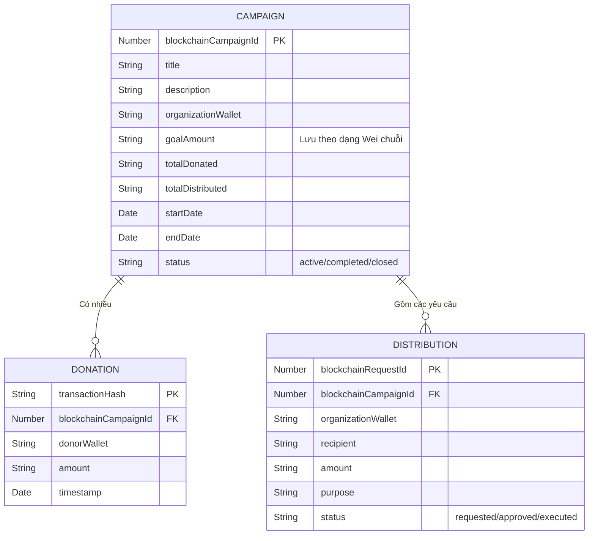

# Tổng Quan Kỹ Thuật (Technical Overview)

## Mục lục
1. [Giới thiệu dự án](#1-giới-thiệu-dự-án)
2. [Danh sách chức năng chính](#2-danh-sách-chức-năng-chính)
3. [Công nghệ sử dụng (Tech Stack)](#3-công-nghệ-sử-dụng)
4. [Kiến trúc hệ thống](#4-kiến-trúc-hệ-thống)
5. [Cấu trúc thư mục](#5-cấu-trúc-thư-mục)
6. [Thiết kế Database](#6-thiết-kế-database)
7. [API Endpoints](#7-api-endpoints)
8. [Xác thực và Phân quyền](#8-xác-thực-và-phân-quyền)
9. [Điểm đáng chú ý và Hạn chế](#9-điểm-đáng-chú-ý-và-hạn-chế)

---

## 1. Giới thiệu dự án
Transparent Charity là một ứng dụng phi tập trung (DApp) nhằm giải quyết bài toán thiếu minh bạch trong các hoạt động kêu gọi quyên góp từ thiện. Bằng cách ứng dụng Smart Contract trên nền tảng Blockchain Ethereum, mọi luồng tiền (từ lúc nhà hảo tâm quyên góp đến khi tổ chức giải ngân) đều được ghi nhận công khai, không thể thay đổi. 
**Đối tượng người dùng:**
- **Khách/Nhà hảo tâm (Donator):** Người muốn theo dõi và đóng góp tài chính cho các chiến dịch.
- **Tổ chức (Organization):** Người tạo chiến dịch và yêu cầu giải ngân quỹ.
- **Quản trị viên (Admin):** Người giám sát, có quyền phê duyệt các yêu cầu giải ngân từ Tổ chức.

---

## 2. Danh sách chức năng chính
Hệ thống được chia làm 3 module chức năng chính:

**Module Smart Contract (Hợp đồng thông minh) - `blockchain/CharityDonation.sol`:**
- Tạo chiến dịch từ thiện (`createCampaign`): Khởi tạo chiến dịch với mục tiêu và thời hạn.
- Quyên góp (`donate`): Chuyển ETH thẳng vào hợp đồng.
- Yêu cầu phân phối/rút tiền (`createDistributionRequest`): Tổ chức tạo phiếu xin rút tiền kèm lý do.
- Phê duyệt rút tiền (`approveDistribution`): Admin kiểm duyệt phiếu xin rút.
- Thực thi phân phối (`executeDistribution`): Chuyển tiền vào ví người thụ hưởng khi phiếu được duyệt.

**Module Backend (Đồng bộ dữ liệu) - `backend/services/blockchainListener.js` & `backend/routes/`:**
- Lắng nghe sự kiện (Event Listener): Quét các sự kiện `CampaignCreated`, `DonationReceived`, `FundDistributionApproved`, `FundDistributed` từ Blockchain và đồng bộ vào DB để frontend truy xuất nhanh.
- Phục vụ API (`campaignRoutes.js`, `donationRoutes.js`...): Cung cấp các endpoint cho Frontend hiển thị danh sách chiến dịch, lịch sử đóng góp.

**Module Frontend (Giao diện DApp) - `frontend/src/`:**
- Kết nối ví Web3 (`WalletContext.jsx`): Giao tiếp với ví MetaMask của người dùng.
- Tương tác với Smart Contract: Gọi các hàm đọc/ghi dữ liệu on-chain trực tiếp.
- Hiển thị dữ liệu: Hiển thị giao diện cho Homepage, Campaign Detail, Dashboard, Admin và Organization (`src/pages/`).

---

## 3. Công nghệ sử dụng
| Thành phần | Thư viện/Công nghệ | Phiên bản | Vai trò & Lý do sử dụng (Suy ra từ mã nguồn) |
| :--- | :--- | :--- | :--- |
| **Frontend** | ReactJS | `^19.2.8` | Xây dựng giao diện UI (Sử dụng Vite để build nhanh). |
| | Ethers.js | `^6.17.0` | Thư viện cốt lõi tương tác với RPC/Smart Contract từ phía client. |
| | React Router | `^7.18.4` | Điều hướng giữa các trang (Routing). |
| **Backend** | Node.js / Express | `^4.19.2` | Máy chủ API hạng nhẹ phục vụ metadata, log off-chain nhanh chóng. |
| | Ethers.js | `^6.13.2` | Tương tác Blockchain, lắng nghe Event thông qua `ethers.JsonRpcProvider`. |
| | express-rate-limit | `^8.7.0` | Hạn chế DDoS/Spam request lên API. |
| **Database** | MongoDB & Mongoose | `^8.5.2` | Lưu trữ dữ liệu metadata và log giao dịch đồng bộ từ Blockchain giúp frontend load nhanh không cần crawl chain. |
| **Smart Contract**| Solidity | N/A | Ngôn ngữ viết Hợp đồng thông minh Ethereum. |
| **Hosting/Infra** | Local / Chưa rõ | N/A | Repo chưa cấu hình Docker hay cloud provider cụ thể. |

---

## 4. Kiến trúc hệ thống
Hệ thống sử dụng mô hình hybrid (Lai giữa Web2 và Web3): 
- Mọi giao dịch thay đổi trạng thái (Gửi tiền, Tạo chiến dịch) đều được Frontend ký gửi trực tiếp lên Smart Contract (Web3).
- Backend hoạt động như một "Indexer" thu nhỏ, lắng nghe Event và lưu vào MongoDB. Frontend gọi lên Backend để lấy lịch sử dữ liệu hiển thị, tối ưu hiệu suất (Web2).

```mermaid
flowchart TD
    User([Người dùng / Metamask])
    Frontend[Frontend - React/Vite]
    Backend[Backend - Express API]
    Listener[Blockchain Listener Service]
    DB[(MongoDB)]
    SmartContract{Smart Contract trên Sepolia}

    User <-->|Tương tác UI & Ký Transaction| Frontend
    Frontend -->|Gửi Giao Dịch (Write)| SmartContract
    SmartContract -->|Phát ra Sự kiện (Events)| Listener
    Listener -->|Đồng bộ & Lưu trữ| DB
    DB <--> Backend
    Frontend <-->|Fetch Lịch sử (Read API)| Backend
```

---

## 5. Cấu trúc thư mục
Các file quan trọng trong mã nguồn:
- **`backend/`**: Mã nguồn API Server.
  - `server.js`: File entry point cấu hình Express, kết nối DB và gọi Listener.
  - `models/`: Chứa các Schema DB (`Campaign.js`, `Donation.js`, `Distribution.js`).
  - `routes/`: Các file định nghĩa Endpoint.
  - `services/blockchainListener.js`: Logic lắng nghe event từ mạng lưới Sepolia và ghi đè vào Mongoose Model.
- **`frontend/`**: Mã nguồn Web DApp.
  - `src/App.jsx`: Cấu trúc Router chính và Providers.
  - `src/context/`: Các State toàn cục (Language, Toast, đặc biệt là `WalletContext.jsx` để kết nối MetaMask).
  - `src/pages/`: Các màn hình chính (Trang chủ, Chi tiết, Dashboard...).
  - `src/contracts/contractConfig.js`: Nơi import ABI và cấu hình logic để React nói chuyện với Contract.
- **`blockchain/`**:
  - `CharityDonation.sol`: Mã nguồn hợp đồng thông minh.
  - `CharityDonation.json`: File ABI.

---

## 6. Thiết kế Database
Backend sử dụng MongoDB để làm bản sao lưu nhanh (Cache/Indexer) các dữ liệu trên chain.



---

## 7. API Endpoints
API chạy tại `http://localhost:5000/api` (mặc định theo code).
| Method | Endpoint | Mô tả chức năng (`backend/routes/`) |
| :--- | :--- | :--- |
| `GET` | `/health` | Kiểm tra trạng thái máy chủ và kết nối Database. |
| `GET` | `/campaigns` | Lấy danh sách toàn bộ chiến dịch (Sắp xếp mới nhất). |
| `GET` | `/campaigns/:id` | Lấy chi tiết một chiến dịch qua `blockchainCampaignId`. |
| `POST`| `/campaigns` | API phụ để frontend gọi ép đồng bộ campaign nếu Listener chưa kịp quét. |
| `GET` | `/donations` | Lấy danh sách mọi giao dịch quyên góp. |
| `GET` | `/donations/campaign/:campaignId` | Lấy lịch sử quyên góp của 1 chiến dịch. |
| `POST`| `/donations` | Ghi nhận/Đồng bộ quyên góp thủ công. |
| *(Tương tự)* | `/distributions/...` | Lấy danh sách/chi tiết các yêu cầu giải ngân quỹ. |

---

## 8. Xác thực và Phân quyền
Dự án **KHÔNG** sử dụng Username/Password, JWT hay Session truyền thống ở backend. Toàn bộ cơ chế Auth dựa vào Địa chỉ Ví (Wallet Address) qua thư viện Ethers.js.
- **Phân quyền Backend**: Phụ thuộc vào việc chuỗi wallet gởi lên API có khớp với dữ liệu trên DB. (Lưu ý: API hiện thiết kế dạng public, chỉ frontend ràng buộc quyền xem).
- **Phân quyền Blockchain (`CharityDonation.sol`)**:
  - `modifier onlyAdmin`: So khớp `msg.sender == admin` để duyệt yêu cầu giải ngân. (Admin được gán là ví thực hiện deploy contract).
  - `modifier onlyOrganization`: Bắt buộc ví gọi hàm rút tiền phải là ví đã tạo ra chiến dịch đó (`campaign.organization`).

---

## 9. Điểm đáng chú ý và Hạn chế
- **Ưu điểm**: Thiết kế kiến trúc Hybrid rất tốt, giảm tải chi phí gọi RPC node (Infura/Alchemy) do frontend lấy danh sách từ Backend, và chỉ tương tác ví khi cần Ghi dữ liệu.
- **Hạn chế đã biết**:
  - Backend API đang thiếu cơ chế bảo mật (như ký Signature xác minh ví). Bất kì ai gọi Post API vào endpoint đồng bộ cũng có thể can thiệp DB (Dù không ảnh hưởng on-chain nhưng sai lệch hiển thị).
  - `blockchainListener.js` sử dụng WebSocket/Polling đơn giản, nếu server sập tạm thời có thể **bỏ sót (miss)** Event khi bật lại (Chưa có cơ chế quét các Block bị miss trong quá khứ).
  - Repo không có framework biên dịch và deploy Smart Contract như Hardhat/Truffle mà chỉ để file mã nguồn trần. Cần dùng Remix IDE để thao tác thủ công.
  - Chưa hỗ trợ Docker/Docker Compose để tự động hóa setup. Cần xác nhận có định thêm vào không.
